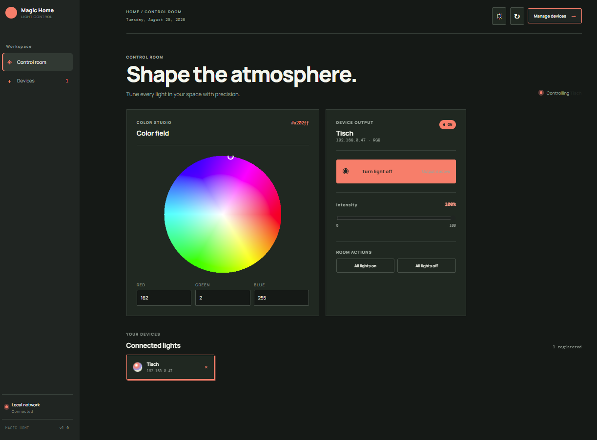
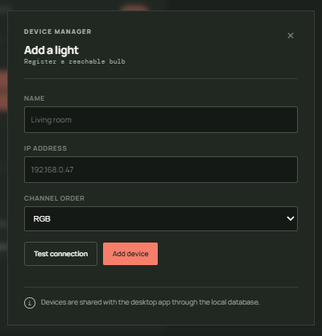
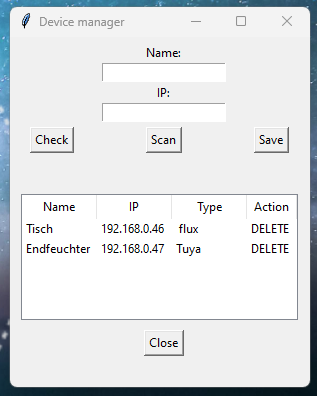

# Magic Home Control

A local smart-light controller for Flux LED bulbs. The project provides a FastAPI backend, an Angular web interface, and the original Tkinter system-tray desktop client.

## Architecture

```text
Angular web app  ->  FastAPI backend  ->  Flux LED bulbs
Tkinter desktop  ->  local desktop client
                         |
                    shared SQLite database
```

The backend is the API boundary for the web application. The desktop client remains available and shares device configuration through the same SQLite database.

## Features

- Modern responsive web control room
- Dark mode by default, with a saved light-mode option
- Accurate HSV color wheel and RGB controls
- Brightness control that can recover after reaching 0%
- Turn one bulb on or off
- Turn all configured bulbs on or off
- Add, test, and remove devices
- Configurable RGB channel order: RGB, GRB, BGR, GBR, RBG, or BRG
- FastAPI interactive documentation
- Tkinter system-tray desktop application
- SQLite device storage

## Screenshots

### Web Application

The web application runs as a modern control room with device controls, a color wheel, brightness control, device management, and dark mode.





### Desktop Application

The original desktop screenshots are kept here. The desktop client remains available alongside the web application.




## Requirements

For the Docker setup:

- Docker Desktop with Docker Compose
- Bulbs reachable on the same local network as the Docker host

For the desktop client without Docker:

- Python 3.11 or newer
- Tkinter, normally included with standard Python for Windows

Install desktop dependencies:

```powershell
pip install pillow pystray flux_led numpy requests
```

## Run The Web Application

From the repository root:

```powershell
docker compose up --build
```

Open the applications here:

- Web frontend: http://localhost:8080
- API documentation: http://localhost:8000/docs
- API health check: http://localhost:8000/api/health

Run the services in the background:

```powershell
docker compose up -d --build
```

Useful Docker commands:

```powershell
docker compose ps
docker compose logs -f backend
docker compose logs -f frontend
docker compose down
```

## Run The Desktop Application

The desktop client is kept separately from the web frontend:

```powershell
python -m desktop.app.main
```

The desktop application uses the shared SQLite database at `data/devices.db`.
## Device Configuration

Use the web interface's **Manage devices** action to add a bulb. A device must be reachable before it can be saved.


After the first backend start, active device data is stored in:

```text
data/devices.db
```

The API returns HTTP 504 when a registered or new device is unreachable. Docker must have access to the local network, and the bulb must be powered on.

## API Overview

| Method | Endpoint | Purpose |
| --- | --- | --- |
| GET | `/api/devices` | List devices |
| POST | `/api/devices` | Test and add a device |
| POST | `/api/devices/check` | Check an IP address |
| DELETE | `/api/devices/{ip}` | Remove a device |
| GET | `/api/devices/{ip}/state` | Read power, color, and brightness |
| POST | `/api/devices/{ip}/on` | Turn one device on |
| POST | `/api/devices/{ip}/off` | Turn one device off |
| POST | `/api/devices/all/on` | Turn all devices on |
| POST | `/api/devices/all/off` | Turn all devices off |
| PUT | `/api/devices/{ip}/color` | Set RGB color |
| PUT | `/api/devices/{ip}/brightness` | Set brightness from 0 to 100 |

## Project Structure

```text
Magic-Home-Control/
├── backend/
│   ├── app/
│   │   ├── main.py              FastAPI routes
│   │   ├── bulb_service.py      Flux bulb operations
│   │   ├── repository.py        SQLite persistence
│   │   ├── models.py            API models
│   │   └── tests/               Backend tests
│   └── Dockerfile
├── frontend/
│   ├── src/app/                 Angular application
│   ├── Dockerfile
│   └── nginx.conf
├── desktop/
│   ├── app/                     Tkinter and tray client
│   │   └── device_repository.py SQLite persistence adapter
│   ├── assets/                  Desktop images
│   └── tests/                   Desktop tests
├── data/
│   ├── devices.csv              Migration seed file
│   └── devices.db               Runtime SQLite database
├── compose.yaml
└── README.md
```

## Testing

Run the desktop and migration tests from the repository root:

```powershell
python -m pytest desktop/tests -q
```

Validate the Python source:

```powershell
python -m compileall -q backend desktop
```

## Security

This application is intended for a trusted local network. Do not expose the API directly to the internet. Add authentication, HTTPS, and stronger network controls before remote access.

## License

This project is licensed under the MIT License. See `LICENSE`.
