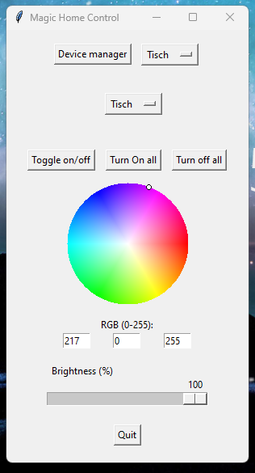

# Magic Home Control

A Python-based GUI application to control smart WiFi LED bulbs using the `flux_led` library. The application provides a system tray icon, a graphical interface to manage and control connected bulbs, and the ability to save and load device configurations.

## 📌 Status

🚧 **Work in Progress**  
This project is under active development – feedback and suggestions are welcome.

## Features
- **System Tray Control:** Run the app from the system tray with quick actions.
- **GUI for Device Management:** Add, remove, and manage smart bulbs.
- **Color and Brightness Adjustment:** Change bulb colors and brightness dynamically.
- **Bulk Control:** Turn all bulbs on or off at once.
- **Persistent Device Storage:** Saves device configurations in a CSV file.
- **Connection Testing:** Check connectivity to bulbs before saving them.

## 🖼️ Screenshots

### 🌈 Main Window


### 💡 Device Manager


## Installation
### Prerequisites
- Python 3.x
- Required dependencies:
  ```bash
  pip install pillow pystray flux_led numpy
  ```

## Backend and Web Frontend

The desktop application is contained in `desktop/`. A separate FastAPI backend and Angular frontend are provided for the web version:

```text
Angular frontend -> FastAPI backend -> Flux LED bulbs
Tkinter desktop  -> local desktop code (existing app)
```

Install Docker Desktop, then from the project root run:

```powershell
docker compose up --build
```

Open the web frontend at `http://localhost:8080` and the backend API documentation at `http://localhost:8000/docs`. Device configuration is persisted in SQLite at `data/devices.db`; the existing CSV is imported automatically on first startup. The existing desktop app can continue to run with `python -m desktop.app.main`; `desktop/api_client.py` is available for gradually connecting it to the backend.

The backend must be able to reach the bulbs on the local network. Do not expose it to the internet without adding authentication and HTTPS.

### Running the Application
1. Clone the repository:
   ```bash
   git clone https://github.com/yourusername/Magic-Home-Control.git
   cd Magic-Home-Control
   ```
2. Run the main script:
   ```bash
   python -m desktop.app.main
   ```

## Usage
- **Adding a Device:** Open the device manager and enter the bulb's name and IP address.
- **Turning Lights On/Off:** Click the system tray icon or use the GUI window.
- **Changing Colors:** Use the GUI color wheel to set RGB values.
- **Adjusting Brightness:** Modify brightness levels with the slider. (does only work for device with only rgb no rgbw)

## File Structure
```
Magic-Home-Control/
├── backend/       # FastAPI API and bulb service
├── frontend/      # Angular web application
├── desktop/       # Tkinter/tray client and desktop tests
├── data/          # Persistent device configuration
├── compose.yaml   # Full-stack Docker orchestration
└── README.md
```

## Future Improvements
- [ ] Enhance UI for better user experience
- [ ] Implement more smart home integrations

## License
This project is licensed under the MIT License. See the `LICENSE` file for details.

## Contributing
Contributions are welcome! Feel free to submit a pull request or open an issue.
